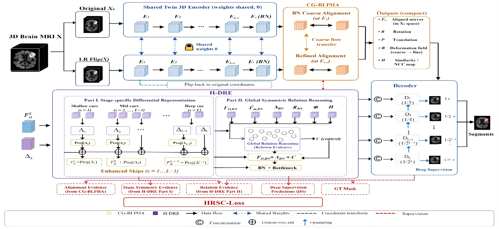
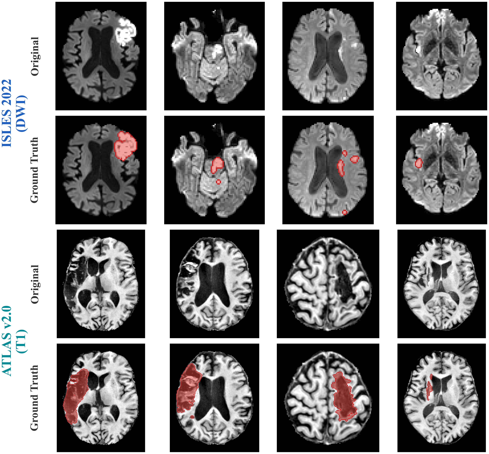

# BSPS-Net

## Brain Hemispheric Symmetry Prior-Guided Hierarchical Difference Reasoning for Ischemic Stroke Lesion Segmentation

Official repository for **BSPS-Net**, a brain hemispheric symmetry prior-guided framework for ischemic stroke lesion segmentation.

> **Manuscript status:** Under review at **Neurocomputing**.  
> **Repository status:** Placeholder repository. The complete reproducibility package will be released after manuscript acceptance.

---

## Overview

Accurate segmentation of ischemic stroke lesions remains challenging because lesions vary substantially in size, morphology, spatial distribution, and imaging appearance. Small and spatially scattered lesions are particularly prone to missed detection, while irregular boundaries and inter-subject anatomical variation further complicate lesion delineation.

BSPS-Net exploits the approximate bilateral symmetry of the human brain and uses **contralateral homologous tissue as a patient-specific anatomical reference**. Instead of identifying lesions solely from the affected image, the framework establishes cross-hemispheric correspondence and models pathological differences between homologous brain regions at multiple representation levels.

The overall reasoning process can be summarized as:

> **Homologous Correspondence → Hierarchical Difference Reasoning → Symmetry-Aware Supervision**

BSPS-Net is implemented within the **nnU-Net v2** framework and introduces three main components:

- **CG-BLPHA** — Correlation-Guided Bidirectional Lesion-Preserving Homologous Alignment
- **H-DRE** — Hierarchical Differential Representation and Global Symmetric Relation Reasoning
- **HRSC-Loss** — Hemispheric Relation-Symmetry Constraint Loss

---

## Network Architecture

<p align="center">
  
</p>

<p align="center">
  <em>Figure 1. Overall architecture of BSPS-Net.</em>
</p>

The original MRI and its left-right mirrored counterpart are processed by a shared twin encoder. Cross-hemispheric homologous correspondence is first estimated by CG-BLPHA. H-DRE then extracts stage-specific differential evidence and performs global relation reasoning. HRSC-Loss introduces the hemispheric symmetry prior into network optimization.

---

## Method

### 1. CG-BLPHA

**Correlation-Guided Bidirectional Lesion-Preserving Homologous Alignment**

Simple left-right mirroring does not guarantee accurate anatomical correspondence because of individual differences in cortical folding, ventricular morphology, head position, and local brain structure.

CG-BLPHA therefore establishes adaptive homologous correspondence between the two hemispheres using:

- local 3D correlation matching;
- bidirectional correspondence estimation;
- lesion-preserving deformation modulation;
- geometric reliability estimation;
- coarse-to-fine deformation refinement;
- bidirectional and cycle-consistency constraints.

The module is designed to reduce pseudo-differences caused by anatomical misalignment while avoiding excessive deformation of genuine lesion-related asymmetry.

---

### 2. H-DRE

**Hierarchical Differential Representation and Global Symmetric Relation Reasoning**

Bilateral differences have different meanings at different feature depths. H-DRE therefore models pathological asymmetry according to feature hierarchy.

The module includes:

#### Shallow-level differential representation
Focuses on:

- signal differences;
- lesion boundaries;
- local high-frequency changes.

#### Intermediate-level differential representation
Focuses on:

- structural differences;
- texture abnormalities;
- local cross-hemispheric correspondence.

#### Deep-level differential representation
Focuses on:

- semantic differences;
- regional relationships;
- high-level lesion context.

#### Global symmetric relation reasoning
At the bottleneck, H-DRE further integrates:

- original hemisphere features;
- aligned contralateral features;
- hierarchical differential priors;
- geometric correspondence;
- spatial information;
- correspondence reliability.

This enables joint modeling of local lesion differences and long-range homologous relationships.

---

### 3. HRSC-Loss

**Hemispheric Relation-Symmetry Constraint Loss**

HRSC-Loss introduces the hemispheric symmetry prior directly into optimization.

Its main principle is:

> **Normal homologous tissue should remain similar, while pathological lesion regions should preserve discriminative asymmetry.**

The loss constrains:

- normal homologous consistency;
- lesion-related pathological asymmetry;
- hierarchical differential responses;
- multi-scale segmentation predictions.

Alignment-related geometric regularization is additionally used to stabilize the correspondence estimation process.

---

## Study Design

BSPS-Net was evaluated on two public stroke MRI datasets and an independent clinical DWI cohort.

| Dataset | Modality | Cases | Train | Validation | Test / External | Role |
|---|---|---:|---:|---:|---:|---|
| ISLES 2022 | DWI | 250 | 200 | 25 | 25 | Model development and internal evaluation |
| ATLAS v2.0 | T1-weighted MRI | 655 | 523 | 66 | 66 | Independent segmentation task |
| Private clinical cohort | DWI | 69 | — | — | 69 | External clinical validation |

The two public datasets were processed and trained independently and did not share preprocessing statistics, nnU-Net planning parameters, or model weights.

The independent clinical cohort was used only for external evaluation. No clinical cases were used for training, hyperparameter optimization, checkpoint selection, or model adaptation.

---

## Dataset Examples

<p align="center">
  
</p>

<p align="center">
  <em>Figure 2. Representative MRI samples from ISLES 2022, ATLAS v2.0, and the independent clinical cohort.</em>
</p>

---

## Datasets

### ISLES 2022

**ISLES 2022** contains acute-to-subacute ischemic stroke MRI.

In this study:

- 250 publicly annotated cases were used;
- DWI acquired at `b = 1000 s/mm²` was used as the input;
- patient-level split: `200 / 25 / 25`;
- dataset-specific nnU-Net v2 preprocessing and experiment planning were applied.

Official dataset publication:

> Hernandez Petzsche MR, de la Rosa E, Hanning U, et al.  
> ISLES 2022: A multi-center magnetic resonance imaging stroke lesion segmentation dataset.  
> *Scientific Data*, 2022.

---

### ATLAS v2.0

**ATLAS v2.0** contains structural T1-weighted MRI from patients with stroke lesions.

In this study:

- 655 annotated cases were used;
- T1-weighted MRI was used as input;
- patient-level split: `523 / 66 / 66`;
- the dataset was independently preprocessed and trained.

Official dataset publication:

> Liew SL, Tavenner BP, Donnelly MR, et al.  
> A large, curated, open-source stroke neuroimaging dataset to improve lesion segmentation algorithms.  
> *Scientific Data*, 2022.

---

### Independent Clinical DWI Cohort

An independent clinical cohort of **69 ischemic stroke patients** from the **People's Hospital of Yingde City** was used for external validation.

Clinical imaging characteristics include:

- DWI;
- `b = 1000 s/mm²`;
- 3.0 T Siemens or GE MRI systems;
- no retraining;
- no fine-tuning;
- no external-domain adaptation;
- no threshold optimization;
- no checkpoint reselection.

The clinical imaging study was approved by the:

> **Medical Ethics Committee of People's Hospital of Yingde City**  
> Approval No. **2025-1LSP-261**

The clinical imaging data are not publicly available because of institutional ethics and data-governance restrictions.

---

## Lesion-Size Analysis

The study additionally evaluates performance according to lesion volume.

Individual lesions are identified as three-dimensional connected components in the ground-truth masks, and physical lesion volume is determined from voxel count and voxel spacing.

The analysis includes:

- small lesions;
- medium lesions;
- large lesions;
- lesion-level Dice;
- lesion-level sensitivity.

The manuscript reports that the performance differences between BSPS-Net and competing methods are more pronounced for small lesions than for medium and large lesions.

Dataset-specific lesion-size thresholds are used because ISLES 2022 and ATLAS v2.0 differ substantially in lesion characteristics, spatial resolution, imaging modality, and stroke stage.

---

## Main Results

The current manuscript reports the following overall segmentation performance.

| Dataset | Dice (%) | IoU (%) | Sensitivity (%) | F2 (%) | HD95 (mm) |
|---|---:|---:|---:|---:|---:|
| ISLES 2022 | **84.86** | **73.79** | **85.21** | **85.04** | **31.39** |
| ATLAS v2.0 | **66.46** | **49.83** | **67.12** | **66.85** | **34.79** |
| Independent clinical cohort | **79.86** | **64.28** | **77.13** | **78.62** | **33.74** |

On the independent clinical cohort, BSPS-Net improved Dice by **5.13 percentage points** over the strongest competing baseline and reduced HD95 by **5.69 mm**.

These results correspond to the current manuscript version and may be updated if revisions are made during peer review.

---

## Framework

BSPS-Net is developed on top of **nnU-Net v2**.

nnU-Net v2 provides the underlying infrastructure for:

- dataset conversion;
- image preprocessing;
- experiment planning;
- normalization;
- resampling;
- patch-based training;
- data augmentation;
- deep supervision;
- inference;
- post-processing;
- evaluation.

BSPS-Net extends this framework with hemispheric symmetry modeling and hierarchical cross-hemispheric difference reasoning.

---

# Repository Status

> 🚧 **This repository is currently maintained as the official placeholder repository for BSPS-Net.**

The manuscript is currently **under review at Neurocomputing**.

To keep the public implementation consistent with the final accepted manuscript, the complete source code and reproducibility package are **not publicly released at this stage**.

The complete implementation will be released after formal manuscript acceptance.

---

## Planned Release After Acceptance

Following acceptance of the paper, this repository will be updated with the complete reproducibility package.

### Source Code

The planned release includes:

- complete BSPS-Net implementation;
- CG-BLPHA module;
- H-DRE module;
- HRSC-Loss;
- nnU-Net v2 integration;
- network configuration files;
- training scripts;
- inference scripts;
- evaluation scripts;
- visualization scripts.

---

### Data Preprocessing

The release will include the preprocessing materials required to reproduce the study, including:

- dataset conversion scripts;
- spatial orientation handling;
- anatomical left-right axis verification;
- image-label geometry checking;
- resampling configuration;
- intensity normalization;
- symmetry-preserving cropping and padding;
- mirrored-input construction;
- paired patch sampling;
- paired data augmentation;
- lesion-volume analysis scripts.

---

### nnU-Net v2 Planning Files

Dataset-specific nnU-Net v2 configurations will be released, including:

- `dataset.json`;
- `nnUNetPlans.json`;
- experiment planning parameters;
- target voxel spacing;
- patch size;
- batch size;
- normalization configuration;
- architecture configuration;
- inference configuration.

---

### Dataset Splits

The exact patient-level splits used in the manuscript will be released after acceptance.

This will include:

```text
ISLES 2022
├── training
├── validation
└── test

ATLAS v2.0
├── training
├── validation
└── test
````

Only dataset identifiers and split-definition files will be released.

> **Original MRI data and lesion annotations will not be redistributed through this repository.**

Users must obtain ISLES 2022 and ATLAS v2.0 from their official sources and comply with the corresponding dataset licenses and data-use agreements.

---

### Training Configuration

The final release will document the complete experimental configuration, including:

```text
Framework
Network architecture
Input configuration
Target spacing
Patch size
Batch size
Optimizer
Initial learning rate
Learning-rate scheduler
Number of epochs
Data augmentation
Deep supervision
Loss weights
Alignment parameters
Random seeds
Mixed-precision configuration
Checkpoint selection
Inference configuration
Post-processing
Hardware environment
Software environment
```

---

### Model Weights

The trained model checkpoints corresponding to the experiments reported in the final accepted manuscript will be released where permitted by applicable data-use and institutional policies.

Planned checkpoints include models trained for:

* ISLES 2022;
* ATLAS v2.0;
* reported random-seed experiments.

The corresponding preprocessing parameters and configuration files will be released together with the weights.

> **Model weights are not publicly available during manuscript peer review.**

---

### Evaluation and Reproduction

The final release is planned to include:

* voxel-level evaluation;
* Dice;
* IoU;
* Sensitivity;
* F2-score;
* HD95;
* lesion-size-stratified evaluation;
* lesion-volume statistics;
* model complexity evaluation;
* FLOPs calculation;
* parameter counting;
* inference-time evaluation;
* qualitative visualization scripts.

---

## Reproducibility

Reproducibility is a central objective of this repository.

After manuscript acceptance, we plan to release the materials required to reproduce the principal experiments:

> **Source Code + Model Configuration + Preprocessing Parameters + nnU-Net Plans + Dataset Splits + Model Weights + Evaluation Scripts**

The implementation will retain compatibility with the standard nnU-Net v2 directory organization and experiment workflow whenever possible.

---

## Current Availability

| Resource                      | Current status              |
| ----------------------------- | --------------------------- |
| Manuscript information        | Available                   |
| Network architecture figures  | Available                   |
| Dataset information           | Available                   |
| Complete BSPS-Net source code | 🔒 Release after acceptance |
| CG-BLPHA implementation       | 🔒 Release after acceptance |
| H-DRE implementation          | 🔒 Release after acceptance |
| HRSC-Loss implementation      | 🔒 Release after acceptance |
| Training scripts              | 🔒 Release after acceptance |
| Inference scripts             | 🔒 Release after acceptance |
| Evaluation scripts            | 🔒 Release after acceptance |
| Preprocessing scripts         | 🔒 Release after acceptance |
| nnU-Net v2 plans              | 🔒 Release after acceptance |
| Dataset split files           | 🔒 Release after acceptance |
| Model checkpoints             | 🔒 Release after acceptance |
| Environment configuration     | 🔒 Release after acceptance |
| Reproduction instructions     | 🔒 Release after acceptance |

---

## Data Availability

ISLES 2022 and ATLAS v2.0 are publicly available from their respective official repositories.

This repository does **not** redistribute:

* original MRI images;
* manual lesion annotations;
* private clinical images;
* private clinical annotations.

The independent clinical DWI cohort is not publicly available because it is subject to institutional ethics and data-governance restrictions.

---

## Code Availability

The BSPS-Net repository is currently maintained as a placeholder during peer review.

The complete implementation, preprocessing configurations, model weights, dataset split definitions, and reproduction materials will be released **after the manuscript is formally accepted for publication**.

---

## Citation

The manuscript is currently under peer review.

If you find this work useful, please consider citing the formal publication once it becomes available.

The final citation and BibTeX entry will be added after publication.

Temporary manuscript information:

```bibtex
@article{Zhao2026BSPSNet,
  title  = {Brain Hemispheric Symmetry Prior-Guided Hierarchical Difference Reasoning for Ischemic Stroke Lesion Segmentation},
  author = {Zhao, Sichao and Lin, Xiaozhen and Li, Jiayi and Shen, Shujing and Hu, Jianping and He, Yongling and Yan, Wen and Dong, Jianwei and Qiu, Xuejun},
  year   = {2026},
  note   = {Manuscript under peer review}
}
```

> The BibTeX entry above is temporary and will be replaced with the official bibliographic information after publication.

---

## Acknowledgements

BSPS-Net is developed using the **nnU-Net v2** medical image segmentation framework.

We gratefully acknowledge:

* the developers and contributors of nnU-Net;
* the ISLES 2022 organizers and data contributors;
* the ATLAS v2.0 organizers and data contributors;
* the clinical collaborators involved in the independent external validation cohort.

The study was supported by:

* 2026 Guangdong Pharmaceutical University Special Fund for Discipline Optimization and Quality Improvement
  (`XKPYMS20260823`, `XKPYMS20260835`);

* Special Fund for the 2026 Interdisciplinary Pharmaceutical–Medical–Engineering Program at the School of Medical Information Engineering
  (`GDPUMIEZD202604`);

* Medical Scientific Research Foundation of Guangdong Province
  (`B2026621`, `A2026283`);

* Guangdong Undergraduate Teaching Quality and Teaching Reform Project
  (Smart Rehabilitation Modern Industry Institute).

---

## License

The license for the BSPS-Net source code will be specified when the complete implementation is officially released.

Third-party resources, including:

* nnU-Net v2;
* ISLES 2022;
* ATLAS v2.0;

remain subject to their respective licenses, terms of use, and data-sharing policies.

---

## Updates

Major repository updates will be announced here after manuscript acceptance.

Planned updates include:

* source-code release;
* trained model weights;
* preprocessing configurations;
* nnU-Net v2 plans;
* dataset split files;
* training configurations;
* evaluation scripts;
* visualization scripts;
* environment specifications;
* reproducibility instructions.

You may **Star** or **Watch** this repository to follow future releases.

---

## Contact

For questions regarding BSPS-Net, please use the **Issues** section of this GitHub repository.

For academic correspondence regarding the manuscript, please contact the corresponding authors listed in the paper.

---

## Disclaimer

This repository is intended for **research purposes only**.

The current BSPS-Net implementation and experimental results have not been approved as a medical device and should not be used for clinical diagnosis or treatment decisions.

---

**BSPS-Net © 2026**

```
